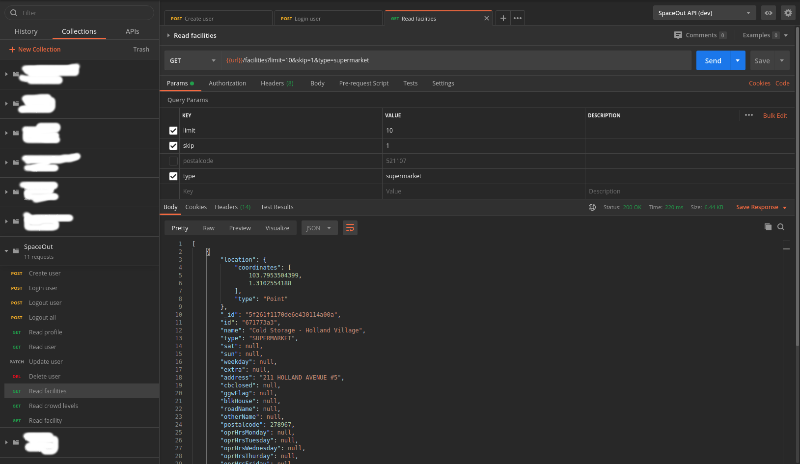

# SpaceOut API

This project provides a RESTful API service for retrieving latest data and historical data for crowd levels information exposed from the following public [SpaceOut](https://www.spaceout.gov.sg/) API:

1. Facility list: `POST https://www.spaceout.gov.sg/graphql?query={ geojsonPoint }`
2. Crowd levels: `POST https://www.spaceout.gov.sg/graphql?query={ facilities { id, band, createdAt, trend } }`

## Functionalities

- Cron jobs or scheduled tasks for polling the above data API every X minutes (configurable, default to 30 minutes) and store the data into a local database.
- RESTful API for retrieving the data from your local database:
  - `GET /facilities`: return all facilities. Supports pagination/filtering of records.
  - `GET /crowdlevels`: return the facilities and associated crowd "band".
    - Filters:
      - Date range: to return the average crowd band for each facility between the start date and end date of the given date range. The start date and end date will be compared against the created date of the data points retrieved from the API #2 above.
      - If filters are empty, return the latest data point for each facility.

## Prerequisite

- Runtime: [Node.js](https://nodejs.org/en/download/) LTS (version 12.x.x)
- Database: MongoDB 4.x.x
- OS: Linux or MacOS

## Tech Stack

- Express.js: web framework
- [Mongoose](https://mongoosejs.com/): MongoDB object modelling for Node.js.
- [node-cron](https://github.com/kelektiv/node-cron): cron jobs for Node.js.
- Automated tests
  - [Jest](https://jestjs.io/): test runner and assertion library
  - [SuperTest](https://github.com/visionmedia/supertest): SuperAgent driven library for testing HTTP servers.
- Automated lint and code style
  - [ESLint](https://eslint.org/): a tool that performs automated scans of JavaScript files for common syntax and style errors using ESLint rules.
  - [Prettier](https://prettier.io/): an opinionated code formatter that scans files for style issues and automatically reformats code to ensure consistent rules are being followed for indentation, spacing, semicolons, single quotes vs double quotes, etc.
  - [Husky](https://github.com/typicode/husky): lets us run commands or script before committing or pushing our code to git.
  - [lint-staged](https://github.com/okonet/lint-staged): run linters on git staged files. Auto lint and format code on Git commit.
- API is protected with JWT authentication.

## Getting Started

We will setup and install our project dependencies.

1. Git clone this repo:

```sh
$ git clone https://github.com/cedrickchee/spaceout-api

$ cd spaceout-api
```

2. Download and install Node.js packages:

```sh
$ npm i
```

3. Configure application settings and environment variables:

Head over to the [config](./config/) directory in the project root and:
- rename [`dev.env.example`](config/dev.env.example) file to `dev.env`.
- rename [`test.env.example`](config/test.env.example) file to `text.env`.

4. Install MongoDB

Follow the instructions provided in MongoDB docs to [install MongoDB Community Edition](https://docs.mongodb.com/manual/administration/install-community/) on your OS. Next, check and ensure your MongoDB connection
string environment variable, `MONGODB_URL` is correctly configured in
[`dev.env`](./config/dev.env) file and [`test.env`](./config/test.env) file.

## Usage

- Run development server: `npm start`
- Develop (watch mode): `npm run dev`
- Run test suite: `npm test`
- Lint code with ESLint: `npm run lint`
- Format code style: `npm run pretty`

## Test REST API Endpoints

I'm using [Postman](https://www.postman.com/) client/tool to test my REST APIs.

I've [shared my Postman collections and environment](https://learning.postman.com/docs/collaborating-in-postman/sharing/) by file in this repository. You can find the [`postman_collection.json` file](./postman_collection.json) in the project root.

See the Postman docs on [how to import the Postman data file](https://learning.postman.com/docs/getting-started/importing-and-exporting-data/).

### Test Instructions



Open Postman, and choose "SpaceOut" collections from your Postman workspace.
First, authenticate a user and get a JWT token. Next, send HTTP requests to the
following API endpoints following the steps below:

1. Create user: POST `/users`

   Create a new user account with your username and password.
2. Login user: POST `/users/login`

   Log in a user. Note: this step will generate the JWT token
   and **automatically** store in Postman environment for use in requests to
   protected API endpoints.
3. Read facilities: GET `/facilities?limit=10&skip=1&type=supermarket`

   Get all facilities. Supports pagination of records (with `limit` and `skip` querystring)
   and filtering of records (with `type` querystring).
4. Read facility: GET `/facilities/6918c778`

   Get one facility information.
5. Read crowd levels: `GET /crowdlevels?start=2020-07-25&end=2020-08-01`

   Get the facilities and associated crowd "band". Supports filtering of records
   by date range: start date (`start`), end date (`end`).

### Assumptions

- Public data API:
  - JSON data format remain the same.
  - Encryption algorithm and key doesn't change.
  - Facility list is not historical data. Thus, when the cron job download the latest facility data, it will overwrite the data in a local database.
- Database design:
  - Data schema: data type for fields are inferred from their value type in the return JSON data.
- REST API:
  - Filters:
    - Date range: start date and end date should be in this date format, `YYYY-mm-dd`. Example, `2020-07-31`.
  - Pagination of records:
    - The query string parameters I will use for pagination are `skip` and `limit`.
    - The `skip` parameter will be used to skip past the number of rows specified while `limit` will limit the number of rows returned. If a value isn't provided by the user, I'll return everything by default. 
  - No sorting of records.
